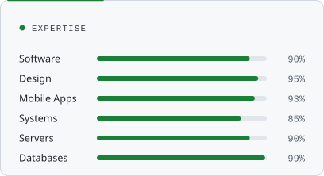
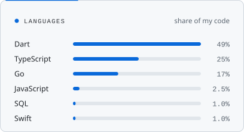

  <a href="https://idisr.com">
    <picture>
      <source media="(prefers-color-scheme: dark)" srcset="assets/hero-dark.svg">
      
    </picture>
  </a>
  <picture>
    <source media="(prefers-color-scheme: dark)" srcset="assets/marquee-dark.svg">
    
  </picture>

## Skills

  <picture><source media="(prefers-color-scheme: dark)" srcset="assets/skills-expertise-dark.svg"></picture>
  <picture><source media="(prefers-color-scheme: dark)" srcset="assets/skills-languages-dark.svg"></picture>
  <picture><source media="(prefers-color-scheme: dark)" srcset="assets/stack-web-dark.svg"></picture>
  <picture><source media="(prefers-color-scheme: dark)" srcset="assets/stack-apps-dark.svg"></picture>
  <picture><source media="(prefers-color-scheme: dark)" srcset="assets/stack-backend-dark.svg"></picture>
  <picture><source media="(prefers-color-scheme: dark)" srcset="assets/stack-tools-dark.svg"></picture>

## Connect

  <a href="https://idisr.com"><picture><source media="(prefers-color-scheme: dark)" srcset="assets/link-website-dark.svg"></picture></a>
  <a href="https://www.youtube.com/@iDhurghamAhmed"><picture><source media="(prefers-color-scheme: dark)" srcset="assets/link-youtube-dark.svg"></picture></a>
  <a href="https://www.instagram.com/idisr"><picture><source media="(prefers-color-scheme: dark)" srcset="assets/link-instagram-dark.svg"></picture></a>
  <a href="https://www.tiktok.com/@vdisr"><picture><source media="(prefers-color-scheme: dark)" srcset="assets/link-tiktok-dark.svg"></picture></a>
  <a href="https://www.snapchat.com/@vdisr"><picture><source media="(prefers-color-scheme: dark)" srcset="assets/link-snapchat-dark.svg"></picture></a>
  <a href="https://www.facebook.com/share/15e8wUqTm7/"><picture><source media="(prefers-color-scheme: dark)" srcset="assets/link-facebook-dark.svg"></picture></a>

